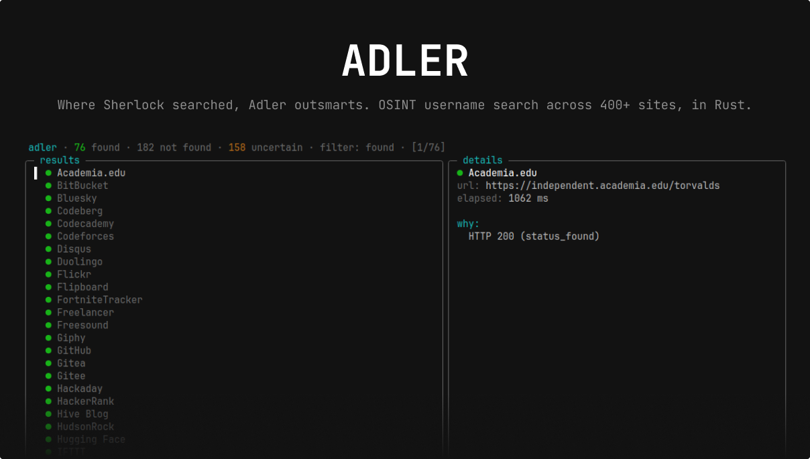

<p align="center">
  
</p>

<p align="center">
  <a href="https://github.com/commit3296/adler/actions/workflows/ci.yml"></a>
  <a href="https://crates.io/crates/adler-cli"></a>
  <a href="https://docs.rs/adler-core"></a>
  <a href="https://adler-docs.pages.dev/"></a>
  <a href="LICENSE"></a>
</p>

<p align="center">
  <a href="https://github.com/commit3296/adler/actions/workflows/audit.yml"></a>
  <a href="https://github.com/commit3296/adler/actions/workflows/codeql.yml"></a>
  <a href="https://scorecard.dev/viewer/?uri=github.com/commit3296/adler"></a>
  <a href="https://www.bestpractices.dev/projects/13082"></a>
</p>

# Adler

> *Named for Irene Adler — "the Woman", the one who outwitted Sherlock Holmes.
> Where Sherlock searched, Adler outsmarts.*

OSINT username search across ~2,600 bundled site entries, in Rust. Honest verdicts and built
to reach the hard ones — Cloudflare-walled, TLS-fingerprinted, geo-restricted,
login-walled.

## Documentation

- 📖 [**adler-docs**](https://adler-docs.pages.dev/) — the user
  manual: install, the access engine, the web UI, embedding, FAQ.
- 🦀 [docs.rs/adler-core](https://docs.rs/adler-core) — Rust API reference.
- 🗺️ [PLAN.md](PLAN.md) — roadmap and the design behind the
  access-engine phases.

This README covers the elevator pitch (compare table, detection rate
data) plus install / quickstart; deeper material lives on the docs
site so it can evolve independently of crate releases.

## How Adler compares

Open-source username-search tools that OSINT operators actually consider, on
the dimensions that matter when sites push back:

|                              | [Sherlock][cmp-s] | [Maigret][cmp-m] | [Blackbird][cmp-b] | [Snoop][cmp-sn] | **Adler** |
| ---------------------------- | :---: | :---: | :---: | :---: | :---: |
| Approx. sites                | 400 | 3,000 | 600 | 5,400 | 2,600 [^cmp-1] |
| Verdict model                | Found / NotFound | Found / NotFound | Found / NotFound | Found / NotFound | **Found / NotFound / Uncertain(reason)** |
| Bot-protected sites (Instagram, X, …) | — | — | — | — | **headless Chrome via `--browser-backend`** |
| TLS-fingerprint blocking     | — | — | — | — | **Chrome 134 handshake via `--features impersonate`** |
| Proxy routing                | one global | one global + Tor + I2P | — | — | one global **or** per-site policy via `--proxy-pool` |
| Cookies / sessions           | — | global `cookies.txt` | — | — | **per-site named sessions** via `--sessions` |
| Registry self-heal           | — | — | — | — | **`--doctor --fix` diffs responses, proposes new signatures** |
| Web UI                       | — | yes (results graph, reports) | — | — | `--web` — live SSE-streaming SolidJS SPA + JSON API |
| Output formats               | text / CSV / XLSX / JSON | text / JSON / CSV / HTML / PDF / XMind / D3 | text / CSV / PDF | text / CSV / HTML | text / JSON / NDJSON / CSV / HTML |
| Embeddable library           | — | yes (Python async) | — | — | `adler-core` on crates.io (Rust) |
| Runtime / packaging          | Python | Python | Python | Python | **Rust — single static binary, `cargo binstall`** |

[^cmp-1]: 1,900 entries in the main registry plus 675 in the default-on WhatsMyName supplement; see [*Site registry*](#site-registry).

[cmp-s]: https://github.com/sherlock-project/sherlock
[cmp-m]: https://github.com/soxoj/maigret
[cmp-b]: https://github.com/p1ngul1n0/blackbird
[cmp-sn]: https://github.com/snooppr/snoop

**Adler's thesis: honest verdicts plus access for the sites that matter.** A
`NotFound` from a Python-HTTP-only tool on a Cloudflare-walled, TLS-
fingerprinted, geo-restricted, or login-walled site is often just "I gave up
at the first wall." Adler reports `Uncertain(reason)` when it couldn't verify,
and ships the transports you need to break the wall yourself — headless
browser, Chrome handshake emulation, per-site geo / IP-type egress, operator-
supplied sessions. We do not solve CAPTCHAs or evade human-verification (see
[*Ethics & responsible use*](#ethics--responsible-use)).

## Detection rate

Recall depends on where you scan from. The last apples-to-apples published
measurement is from a `--doctor` pass on 2026-05-26 against the v0.3.x
registry (411 sites):

| Scan source | Sites where a known-existing account is found | Recall |
| --- | ---: | ---: |
| Datacenter IP (Hetzner / Leaseweb DE) | 282 / 411 | 68.6% |
| US residential proxy pool (DECODO) | **305 / 411** | **74.2%** |

The residential lift is real: ~40 sites swap their verdict between
`Uncertain` (datacenter) and `Found` (residential) — most are
Cloudflare-walled or geo-restricted (RU-segment, plus platforms like
Reddit, Imgur, Patreon). The remaining ~26% breaks down roughly as:

- **Bot-protected sites** tagged `bot-protected` (Instagram and
  X/Twitter today) — these serve a JS login wall to a plain HTTP
  request; a clean IP doesn't help, you need a browser backend.
  Exclude them with `--exclude-tag bot-protected`.
- **Stale Sherlock-imported `known_present` accounts** that no
  longer exist on the live site. The `--doctor --suggest-known-present`
  tool (new in v0.4.0) probes a small candidate pool (the site's
  brand name, plus `torvalds` / `octocat` / `admin` / …) and prints
  a paste-ready snippet for any site where it finds a live account.
  Discovery surfaced 19 healable entries on the most recent sweep;
  the remaining placeholders need either a contributor-found
  candidate or a deeper repair via `--doctor --fix`.
- **Sites whose detection rule fires for *every* username** —
  signal repair territory, not username repair. `--doctor --fix`
  diffs the responses and proposes a tighter signal.
- **Sites that don't reliably distinguish found from not-found** for
  unauthenticated requests at all — investigated and not added
  rather than ship false-positive entries: Reddit, TikTok,
  Pinterest, and Threads. See issues
  [#11–#14](https://github.com/commit3296/adler/issues?q=is%3Aissue+label%3A%22help+wanted%22)
  for the specific failure modes and what would unblock each.

Run the same check yourself: `adler --doctor` (uses your current IP)
or `adler --doctor --proxy <url>` (via your own proxy). With
`--browser-backend browserbase` the doctor's `--fix` mode routes
bot-protected sites through a real Chrome session, so the diff sees
real profile pages rather than two identical login walls. With
`--suggest-known-present` you get an OVERRIDES block per healable
site.

## Crates

| Crate         | Kind | Purpose                                              |
| ------------- | ---- | ---------------------------------------------------- |
| `adler-core`  | lib  | Detection engine, site registry, executor.          |
| `adler-server`| lib  | HTTP API + SSE streaming + scan persistence; embeds the SolidJS web UI via `rust-embed`. |
| `adler-mcp`   | lib  | Model Context Protocol server (`rmcp 1.7`); exposes the OSINT surface to AI agents over stdio + Streamable HTTP+SSE. |
| `adler-cli`   | bin  | `adler` command-line interface; `--web` launches the embedded server + UI in-process; `--mcp` / `--mcp-http` launch the MCP server. |

## Install

From crates.io (compiles locally, ~1–2 min):

```bash
cargo install adler-cli
```

Pre-built binary from the GitHub release (instant, no compile):

```bash
cargo binstall adler-cli            # https://github.com/cargo-bins/cargo-binstall
```

From source:

```bash
git clone https://github.com/commit3296/adler.git
cd adler
cargo install --path adler-cli
```

Requires Rust ≥ 1.85. The installed binary is `adler`. The library
([`adler-core`](https://crates.io/crates/adler-core)) is published separately
for embedding the engine in your own tools — see the
[*Library*](#library) section below.

### Verify release artifacts

Every platform archive attached to a GitHub Release is signed with
[Sigstore cosign](https://github.com/sigstore/cosign) using the GitHub
Actions OIDC identity — no long-lived keys are kept, the signing
certificate is short-lived and bound to the exact workflow that
produced it (visible in the [Rekor](https://search.sigstore.dev/)
transparency log). The signature (`.sig`) and certificate (`.pem`) are
uploaded alongside each archive on the release page.

```bash
TAG=v0.11.3                                  # or whichever release
ARCHIVE=adler-x86_64-unknown-linux-gnu.tar.gz

# Pull the archive + its signature + certificate from the release.
gh release download "$TAG" --repo commit3296/adler \
  --pattern "$ARCHIVE" --pattern "$ARCHIVE.sig" --pattern "$ARCHIVE.pem"

# Verify the signature is bound to this repo's release.yml workflow.
cosign verify-blob \
  --certificate "$ARCHIVE.pem" \
  --signature   "$ARCHIVE.sig" \
  --certificate-identity-regexp '^https://github\.com/commit3296/adler/\.github/workflows/release\.yml@refs/tags/v[0-9]+\.[0-9]+\.[0-9]+' \
  --certificate-oidc-issuer 'https://token.actions.githubusercontent.com' \
  "$ARCHIVE"
```

A successful verification prints `Verified OK`. The identity-regex
pins the signer to *this* repository's `release.yml` at a SemVer tag —
a forged archive uploaded under a different workflow won't satisfy it.

## Build & run

```bash
cargo build --workspace
cargo run -p adler-cli -- alice
```

Logging is controlled by the `ADLER_LOG` env var (defaults to `adler=info`):

```bash
ADLER_LOG=adler=debug cargo run -p adler-cli -- alice
```

## Usage

`adler <username>` scans the embedded registry; everything else is a
knob. Text output shows Found and Uncertain by default and hides
NotFound — pass `--all` for the full list. Results stream into a
terminal as they resolve; piped output is collected and ordered. Exit
codes: `0` found, `1` nothing found, `2` error.

A few of the most common knobs:

```bash
adler --tag dev,social alice               # filter by tags
adler --format ndjson alice                # one JSON object per line
adler --proxy socks5://host:1080 alice     # single proxy for everything
adler --browser-backend local alice        # bot-protected sites via Chrome
adler --input users.txt                    # batch many usernames
adler --watch alice                        # diff vs last run
```

→ Complete flag reference, grouped by intent (filtering / output /
network & sessions / browser & cache / batch & enrichment), is on the
[**Usage**](https://adler-docs.pages.dev/usage/) page.
`adler --help` lists every flag with its short doc; the docs page adds
the bigger picture.

## Web UI

`adler --web` boots a small in-process HTTP server and serves a SolidJS
SPA from the same binary — live SSE-streamed scans, persisted history,
side-by-side diff against an earlier run with a picker for *which*
historical scan to diff against, a read-only access-engine panel,
per-scan egress subset selection when a `--proxy-pool` is loaded, and
a single/batch tab pair so you can paste a list of usernames into the
hero and watch them queue through one at a time.

```bash
adler --web                          # http://127.0.0.1:8080
adler --web --web-bind 0.0.0.0:9000  # listen on all interfaces, custom port
```

> **Warning** — the default bind is loopback. Switching to `0.0.0.0`
> exposes the JSON API to your network. Adler is not built to face the
> open internet; put auth in front of any non-loopback bind.

→ The
[**Web UI**](https://adler-docs.pages.dev/web-ui/) page
covers the full feature set, the `/api/*` surface, and the deployment
notes (the SPA is `rust-embed`'d into the binary; rebuild from source
with `npm ci && npm run build` in `adler-server/web/`).

## MCP server

Adler exposes its OSINT surface to AI assistants over the
[Model Context Protocol](https://modelcontextprotocol.io/). Five
**tools** the agent can call (`list_sites`, `scan_username` with
streamed progress, `scan_batch`, `doctor_check`, `get_scan_history`),
five **resources** it can browse (`adler://registry/{sites,tags,
disabled}`, `adler://scans/recent`, `adler://scans/{id}` template),
and three **prompts** with templated OSINT workflows
(`investigate_username`, `audit_registry_health`,
`correlate_accounts`). Two transports — pick whichever fits how the
agent runs.

```bash
adler --mcp                              # stdio: Claude Desktop / Cursor / local agents
adler --mcp-http 127.0.0.1:8766          # HTTP+SSE: remote agents, mounted at /mcp
```

The HTTP transport inherits `rmcp`'s loopback `allowed_hosts`
DNS-rebind guard out of the box; non-loopback binds expose the API
without authentication, so only do it on a trusted network. The
`instructions` block sent on `initialize` restates the project's
ethical bound (authorised security testing / OSINT research /
defensive work only; no harassment, doxxing, or unauthorised
surveillance) so the agent's first peek at the server names what's
in scope.

→ The [**Usage**](https://adler-docs.pages.dev/usage/#mcp-server)
page lists every tool / resource / prompt with its arguments and
return shape. `adler-mcp/examples/` ships two hand-runnable probes
(stdio + HTTP) that double as reference implementations of a
minimal MCP client.

## Access engine

Adler ships a transport ladder for sites a plain HTTP client can't see —
that's the whole reason it scores ahead of Sherlock / Maigret on the
hard subset of the registry:

- **Browser backend** (`--browser-backend local` / `browserbase`) — real
  headless Chrome for sites tagged `bot-protected` (Instagram, X /
  Twitter today). Bounded by `--browser-budget` so a misconfigured flag
  can't burn a quota.
- **TLS-fingerprint impersonation** (`cargo install --features
  impersonate`) — in-process Chrome 134 BoringSSL handshake for sites
  tagged `protection: tls-fingerprint`. Much cheaper than a real
  browser.
- **Egress pool** (`--proxy-pool <file>`) — per-site geo / IP-type
  routing. Sites with an `access` policy pick a matching proxy; sites
  without stay on the default egress. `region:XX` tags
  auto-populate a *soft* `prefer_geo` (since v0.12) so 685 region-
  tagged sites get a recall lift when a matching egress is configured,
  and fall back to the default when one isn't — no hard
  `Uncertain(GeoUnavailable)`.
- **Sessions** (`--sessions <file>`) — operator-supplied cookies /
  tokens for login-walled sites. Per-site `[name]` tables; values
  redacted from logs.
- **Automatic escalation** (`--escalation-budget N` / `--no-escalation`)
  — when the cheap path returns `Uncertain(cloudflare_challenge |
  rate_limited)`, the router automatically retries through the browser
  backend. Bounded by its own budget. Outcomes carry `transport` and
  `escalations` telemetry so it's clear which path produced each
  verdict. `adler --doctor --suggest-protection` (since v0.13) reads
  that telemetry across runs and flags sites that consistently
  escalate as candidates for adding `protection: cloudflare` up front.

→ Full guide with the TOML formats, guardrails, and trade-offs lives at
[**Access engine**](https://adler-docs.pages.dev/access-engine/).

## Library

`adler-core` is the runtime-agnostic engine that powers the CLI,
published separately on [crates.io](https://crates.io/crates/adler-core)
for embedding in your own Rust tools — a Discord bot that checks
usernames, a security tool that flags exposed identities across a
watchlist, a CI gate that asserts a name isn't claimed elsewhere.

```toml
[dependencies]
adler-core = "0.10"
tokio = { version = "1", features = ["macros", "rt-multi-thread"] }
```

→ Minimal worked example, the notable `ClientBuilder` knobs, and the
per-version breaking-change log are on the
[**Embedding**](https://adler-docs.pages.dev/embedding/)
page. The complete API reference is on
[docs.rs/adler-core](https://docs.rs/adler-core).

## Site registry

The default registry (`adler-core/data/sites.json`, ~2.5k sites) is
generated from MIT-licensed upstream data — Sherlock + Maigret + an
opt-in WhatsMyName tranche (CC BY-SA 4.0; pass `--no-wmn` to drop it
when redistributing scan output under MIT only). Detections are imported
**unverified** — `adler --doctor` validates every signal, `--doctor
--fix` proposes corrected ones, and `--doctor --fix --apply --sites
<path>` (since v0.12) patches them straight into the JSON file with
an atomic sibling-`*.tmp` rewrite.

→ Detailed lineage, schema, signal model, and doctor workflow live in
[**Site registry**](https://adler-docs.pages.dev/site-registry/).

## Troubleshooting

Common questions ("Why is everything Uncertain?", "Why does Adler find
fewer accounts than Sherlock?", "How do I scan Instagram?", …) are
covered in the [**FAQ**](https://adler-docs.pages.dev/faq/) on
the docs site.

For CI / contributor-facing commands (`cargo fmt`, `cargo clippy`,
`cargo test`), see [CONTRIBUTING.md](CONTRIBUTING.md).

## Ethics & responsible use

Adler aggregates publicly reachable profile URLs, but aggregation makes
intrusion easy — please use it responsibly.

**Intended uses:** checking your own accounts; authorized penetration tests
and bug-bounty engagements; security research; and OSINT investigations with
a lawful basis. **Do not** use Adler to stalk, harass, dox, or surveil
people without authorization, or to mass-target individuals.

**Detect, never circumvent.** Adler reports anti-bot responses (rate limits,
Cloudflare challenges, captchas) as `Uncertain` — it does not solve captchas
or bypass access controls. It rate-limits per host, supports `--max-rps` and
`--respect-robots`, and writes an optional `--audit-log` of every request.
See [SECURITY.md](SECURITY.md) and [CODE_OF_CONDUCT.md](CODE_OF_CONDUCT.md).

## License

The Adler **code** is licensed under the [MIT License](LICENSE).

The default site registry (`adler-core/data/sites.json`) is also under MIT
— it is derived from the Sherlock project (MIT) and the Maigret project
(MIT). See the file's `_comment` header and the corresponding importer
scripts in `scripts/` for attribution.

The supplementary registry (`adler-core/data/sites_wmn.json`, included
by default; opt-out with `adler --no-wmn`) is derived from WhatsMyName
and licensed [CC BY-SA 4.0](LICENSE-CC-BY-SA-4.0). Adler's MIT licence
does not cover this file; downstream redistribution must preserve
attribution and the `ShareAlike` obligation on derivative data.
